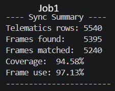
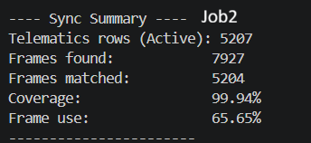
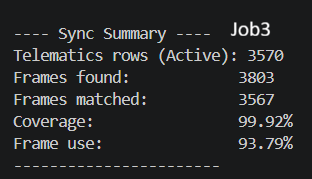

# 🚘 AI-Fleet-Simulator-CV: Computer Vision-Based Driver Behavior AI (Phase 2)

**Jul 2026 – Present** *Building on Phase 1’s IoT Telematics Framework by integrating real-time Computer Vision and Sensor Fusion Analytics.*

---

## 📌 Project Overview & Summary

This project is a continuation of the [AI Fleet Simulator (Phase 1)](https://github.com/MuathM4/AI-Fleet-Simulator). In Phase 2, we integrate a computer vision analytics pipeline to evaluate driver behavior using recorded video footage across **10 transport missions (totaling ~11.5 hours of driving footage)**.

The primary objective is **Sensor Fusion Validation**:
1. **Frame Extraction & Temporal Sync:** Extract video frames and synchronize them with telemetry logs (Ground Truth sensor data collected in Phase 1).
2. **Vision Analytics vs. Ground Truth:** Compare visual detections against physical vehicle sensor logs (speed, steering, RPM, G-force) and calculate percentage discrepancies between computer vision methods and IoT telematics.
3. **Edge-Case Identification:** Determine where vision models provide critical visual context and where physical sensors provide higher precision.

* 📺 **Dataset Demonstration (11.5 Hours Footage):** [YouTube Video](https://youtu.be/aWDoQomXQu8)
* 💻 **Phase 1 Repository:** [AI-Fleet-Simulator](https://github.com/MuathM4/AI-Fleet-Simulator)
* 💻 **Phase 2 Repository:** [AI-Fleet-Simulator-CV](https://github.com/MuathM4/AI-Fleet-Simulator-CV)

---

## 🛠️ Skills & Technologies

* **Computer Vision:** OpenCV, YOLO (You Only Look Once)
* **Data Engineering & Analysis:** Python, Pandas, NumPy, Glob
* **Machine Learning & Modeling:** Sensor Fusion, Time-Series Alignment, Scikit-Learn
* **Simulation & Integration:** Euro Truck Simulator 2 (ETS2), IoT Telemetry Logging

---

## 📊 Telematics & Frame Synchronization Results

Before feeding visual frames into detection models, camera frames were sampled and time-aligned with ground-truth telemetry rows using custom nearest-neighbor timestamp matching and clock-rollover correction logic.

| Mission Dataset | Active Telematics Rows | Frames Extracted | Frames Matched | Coverage (%) | Frame Use (%) |
| :--- | :---: | :---: | :---: | :---: | :---: |
| **Job 1** | 5,540 | 5,395 | 5,240 | **94.58%** | **97.13%** |
| **Job 2** | 5,207 | 7,927 | 5,204 | **99.94%** | **65.65%** |
| **Job 3** | 3,570 | 3,803 | 3,567 | **99.92%** | **93.79%** |

*Note: In Job 2, trailing telematics rows logged after video recording stopped were automatically trimmed to reflect the active video window, achieving **99.94%** coverage.*

---

## 🖼️ Terminal Synchronization Output Proofs

#### **Job 1 Sync Output**


#### **Job 2 Sync Output**


#### **Job 3 Sync Output**


---

## 📂 Project Structure

```text
AI-Fleet-Simulator-CV/
│
├── data/
│   ├── raw_videos/            # Video input files (Job1.mp4, Job2.mp4, Job3.mp4)
│   ├── telematics/            # Ground truth sensor CSVs from Phase 1
│   ├── extracted_frames/      # Extracted frame image files
│   └── processed/             # Synced CSV files containing paired frames & telematics
│
├── docs/
│   └── images/                # Screenshots used in README
│       ├── job1_sync_summary.png
│       ├── job2_sync_summary.png
│       └── job3_sync_summary.png
│
├── src/
│   ├── video_processing_cv.py # Frame extraction and sampling script
│   └── sync_telematics.py     # Timestamp alignment & data synchronization script
│
├── README.md                  # Project documentation
└── requirements.txt           # Python dependencies

```

---

## 🚀 How to Run

### 1. Install Dependencies

```bash
pip install -r requirements.txt

```

### 2. Extract Video Frames

Extract sample frames from video recordings:

```bash
python src/video_processing_cv.py

```

### 3. Synchronize Frames with Telematics Logs

Match extracted video image timestamps with ground-truth sensor rows:

```bash
python src/sync_telematics.py

```

---

## 🔗 Author & Links

* **Author:** Muath Makhlouf
* **LinkedIn:** [Muath Makhlouf](https://www.linkedin.com/in/muath-makhlouf-a198a4308/)
* **GitHub Repository:** [MuathM4/AI-Fleet-Simulator-CV](https://github.com/MuathM4/AI-Fleet-Simulator-CV)

```

```
